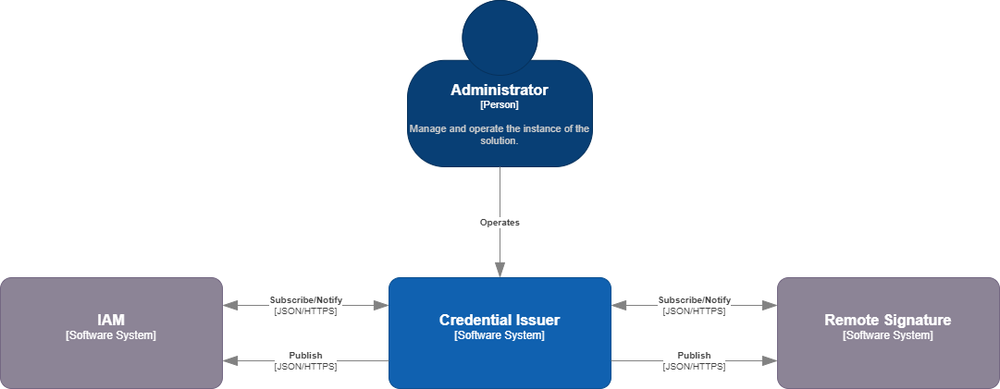

# Introduction
Credential Issuer is a service that allows to generate verifiable credentials. It is designed to be used in a decentralized identity ecosystem, where users can generate the emission of verifiable credentials and store them using the Wallet Server service.

# Architecture


# Functionalities

# Installation

We offer a Docker image to run the application. You can find it in [Docker Hub](https://hub.docker.com/repository/docker/puigcrentials/issuer-api/general).

Here, you can find the [docker-compose.yml](config/docker/compose.yml) file to run the application with all the required dependencies (Context Broker and Blockchain Adapter).

## Running the application (the easy way)
```bash
```bash
cd config/docker
docker-compose up -d
```

## Understanding the Configuration

## Contribution

### How to contribute
If you want to contribute to this project, please read the [CONTRIBUTING.md](CONTRIBUTING.md) file.

## License
This project is licensed under the Apache License 2.0 - see the [LICENSE](LICENSE) file for details.

## Project/Component Status
This project is currently in development.

